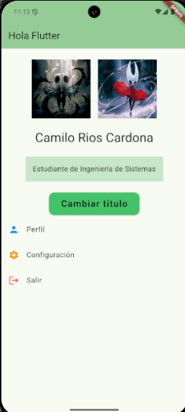
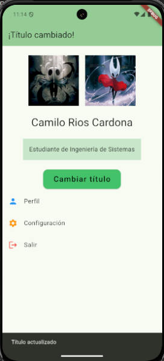

# 📝 Descripción breve
 Este proyecto trata de hacer entreaga del taller 1 de la clase de moviles. el taller incluye lo siguiente:
- **Pantalla principal (HomePage):**
  - `AppBar` con un título inicial: **"Hola, Flutter"**
  - Texto centrado con el **nombre completo del estudiante**.
  - Imágenes mostradas en un `Row`:
    - Una imagen con `Image.network()`.
    - Una imagen con `Image.asset()`.
  - Botón con `setState()`:
    - Alterna el título de la AppBar entre **"Hola, Flutter"** y **"¡Título cambiado!"**.
    - Muestra un **SnackBar** con el mensaje: *"Título actualizado"*.
- **Widgets adicionales:**
  - `Container` con márgenes, colores o bordes aplicados a un widget.
  - `ListView` con 3–4 elementos que incluyen ícono y texto.

#  ⚙️ Pasos para ejecutar
**1. Clonar el repositorio:**
   ```bash
   git https://github.com/CamiloRC18/Curso_Moviles.git
   cd Curso_Moviles
   ```
**2. Verificar si el flutter esta instalado**
```
flutter --version
```
**3. Descargar las librerias**

Para descargar las dependencias del proyecto primero asegurate estar en la carpeta que se creo al clonar el proyecto y luego ejecuta el siguiente comando:
```
flutter pub get
```
**Recomendacion**

Antes de correr el proyecto debes asegurarte que cuentes con un emulador, puedes usar los emuladores de Android Studio

**Ejecutar proyecto**

Para correr el proyecto debes usar el comando:
```
flutter run
```
Debes estar en el directorio del proyecto

# 📸 Capturas de pantalla

**Inicio del proyecto**



**Cambio del titulo**




# Acualizacion del taller 2

## Arquitectura / Navegación
Rutas definidas (go_router):
- `/` -> Home (lib/views/home/home_page.dart)
- `/dashboard` -> Dashboard (lib/views/Dashboard/dashboard_page.dart)
- `/paso_parametros` -> Pantalla para enviar parámetros (lib/views/paso_parametros/paso_parametro_screen.dart)
- `/detalle/:parametro/:metodo` -> Detalle que recibe parámetros por ruta (lib/views/paso_parametros/detalle_screen.dart)
- `/ciclo_vida` -> Pantalla para demostrar ciclo de vida (lib/views/ciclo_vida/ciclo_vida_screen.dart)

Cómo se pasan parámetros:
- Parámetros de detalle se pasan como path parameters en la ruta `/detalle/:parametro/:metodo`.
  - Ejemplo: context.go('/detalle/miValor/go')
  - En DetalleScreen se recupera con state.pathParameters['parametro'] y ['metodo'] en el router.
- Métodos de navegación usados:
  - context.go(path) — reemplaza la ruta actual (no se puede volver con back).
  - context.push(path) — apila la nueva ruta (se puede volver con back).
  - context.replace(path) — reemplaza la ruta actual en la pila.

Nota: appRouter se declara en lib/routes/app_router.dart y se pasa a MaterialApp.router en main.dart.

## Widgets usados y por qué
- MaterialApp.router / GoRouter
  - Manejo centralizado de rutas y parámetros; permite usar context.go/push/replace.
- Scaffold, AppBar
  - Estructura básica de cada pantalla; AppBarTheme centralizado en lib/themes/app_theme.dart para estilo uniforme.
- Drawer (CustomDrawer)
  - Navegación lateral con opciones reutilizables en todo el app.
- Image.network / Image.asset, Row, Container, Divider
  - Mostrar imágenes (remota y local) y estructura en banner + separación visual.
- Text, TextStyle
  - Mostrar datos estáticos (nombre) y personalizar tipografía del botón y títulos.
- ElevatedButton, OutlinedButton, TextButton, ElevatedButton.icon
  - Diferentes acciones con estilos semánticos: acción principal, secundaria y opciones.
- SnackBar
  - Retroalimentación inmediata al usuario (ej. "Título actualizado").
- ListView / ListTile
  - Listas desplazables para menús y listas de ítems (ej. tareas pendientes).
- GridView
  - Mostrar una rejilla de elementos en el dashboard.
- DefaultTabController / TabBar / TabBarView
  - Secciones dentro de una misma pantalla (Dashboard) para organizar Grid/List/Overlay.
- Stack
  - Superponer texto/controles sobre una imagen (overlay).
- Dismissible
  - Interacción para marcar tareas como completadas con gesto de swipe.
- Modal Bottom Sheet (showModalBottomSheet)
  - Mostrar detalles rápidos de un elemento sin cambiar de pantalla.

## Archivos clave / Ubicación
- main.dart — configura MaterialApp.router y routerConfig
  - filepath: lib/main.dart
- app_router.dart — definición de rutas y errorBuilder
  - filepath: lib/routes/app_router.dart
- Tema centralizado
  - filepath: lib/themes/app_theme.dart
- Vistas principales
  - Home: lib/views/home/home_page.dart
  - Dashboard: lib/views/Dashboard/dashboard_page.dart
  - Paso parámetros: lib/views/paso_parametros/paso_parametro_screen.dart
  - Detalle: lib/views/paso_parametros/detalle_screen.dart
  - Ciclo de vida: lib/views/ciclo_vida/ciclo_vida_screen.dart
- Drawer personalizado
  - filepath: lib/widgets/custom_drawer.dart

## Actualizacion del taller 3

## Asincronía / Timer / Isolate (nuevas implementaciones)

### 1 Asincronía con Future / async / await
- Qué se hizo:
  - Servicio simulado que "consulta" datos usando `Future.delayed(Duration(seconds: 2))`.
  - Uso de `async/await` en la UI para esperar el resultado sin bloquear el hilo principal.
  - Estados en UI: `Cargando…`, `Éxito`, `Error`.
  - Prints en consola para mostrar el orden de ejecución: "antes", "durante" y "después".
- Archivo:
  - lib/views/asincronia/asincronia_page.dart
- Cómo probar:
  - Abrir la pantalla "Asincronía" desde el Drawer o `context.go('/asincronia')`.
  - Pulsar "Cargar datos" y observar la UI y la consola (prints).

### 2 Timer (Cronómetro)
- Qué se hizo:
  - Cronómetro con botones: Iniciar / Pausar / Reanudar / Reiniciar.
  - Actualiza la pantalla cada 100 ms (configurable a 1000 ms si se desea 1 s).
  - Cancela el `Timer` en `dispose()` y al pausar (limpieza de recursos).
  - Tiempo mostrado en un `Text` grande con formato mm:ss.cs.
- Archivo:
  - lib/views/Cronometro/cronometro_page.dart
- Cómo probar:
  - Abrir "Cronómetro" desde el Drawer o `context.go('/cronometro')`.
  - Usar los botones para iniciar/pausar/reanudar/reiniciar y verificar que el Timer se detiene al salir.

### 3 Isolate para tarea pesada (CPU-bound)
- Qué se hizo:
  - Implementación de una función CPU-bound (suma de una secuencia grande).
  - Ejecución en un `Isolate` usando `Isolate.spawn`.
  - Comunicación entre isolate y UI por `SendPort` / `ReceivePort`.
  - Resultado enviado desde el isolate mostrado en la UI al terminar.
- Archivo:
  - lib/views/asincronia/asincronia_page.dart (sección Isolate)
- Cómo probar:
  - En la pantalla de Asincronía, ingresar un número grande (p. ej. 5_000_000) y ejecutar.
  - Ver el indicador de ejecución y el resultado cuando llegue; revisar también la consola.


## API usada (breve descripción)

- API principal: TheMealDB (categorías de comidas).
- Endpoint usado: `https://www.themealdb.com/api/json/v1/1/categories.php`
- Uso: obtener lista de categorías y detalles (se consumió desde `ComidaService` en `lib/services/comida.services.dart`).  
- Nota: la URL base también puede configurarse desde el archivo `.env` con la clave `COMIDA_URL_API`.

Ejemplo de respuesta JSON (resumen, un item de `categories`):

```json
{
  "categories": [
    {
      "idCategory": "1",
      "strCategory": "Beef",
      "strCategoryThumb": "https://www.themealdb.com/images/category/beef.png",
      "strCategoryDescription": "Beef is the culinary name for meat from cattle..."
    }
    // ...
  ]
}
```

---

## Arquitectura (carpetas principales)

- lib/models/          — modelos de datos (p. ej. `comida` en `lib/models/comida.dart`)
- lib/services/        — servicios para llamadas HTTP (p. ej. `comida.services.dart`)
- lib/views/           — pantallas / vistas (Home, Dashboard, Cronometro, Asincronía, Comida, etc.)
  - lib/views/comida/        — lista y detalle de categorías
  - lib/views/Cronometro/    — cronometro
  - lib/views/asincronia/    — Future / Isolate demo
- lib/widgets/          — widgets reutilizables (p. ej. `custom_drawer.dart`, `base_view.dart`)
- lib/routes/           — definición de rutas (app_router.dart)
- lib/themes/           — temas y estilos (app_theme.dart)
- .env                  — variables de entorno (opcionales, p. ej. `COMIDA_URL_API`)

---

## Rutas definidas (go_router) y parámetros

- `/`  
  - Home (lib/views/home/home_page.dart)

- `/dashboard`  
  - Dashboard (lib/views/Dashboard/dashboard_page.dart)

- `/paso_parametros`  
  - Pantalla para enviar parámetros (lib/views/paso_parametros/paso_parametro_screen.dart)

- `/detalle/:parametro/:metodo`  
  - Detalle que recibe path parameters `parametro` y `metodo` (lib/views/paso_parametros/detalle_screen.dart)  
  - Ejemplo: `context.go('/detalle/valor/go')` — se recupera en el builder con `state.pathParameters['parametro']` y `['metodo']`.

- `/ciclo_vida`  
  - Demostración ciclo de vida (lib/views/ciclo_vida/ciclo_vida_screen.dart)

- `/cronometro`  
  - Cronómetro (lib/views/Cronometro/cronometro_page.dart)

- `/asincronia`  
  - Demo Asincronía + Isolate (lib/views/asincronia/asincronia_page.dart)

- `/comidas`  
  - Lista de categorías (lib/views/comida/comida_list.dart)

- `/comida/:id`  
  - Detalle de categoría por id (lib/views/comida/comida_detail.dart)  
  - Ejemplo de navegación: `context.push('/comida/1')` o desde la lista `context.push('/comida/${c.id}')`.

- (Opcional/si existe en tu proyecto) `/pokemons` y `/pokemon/:name`  
  - Lista y detalle de Pokémon (si se agregaron los archivos en `lib/views/pokemon/`).

Cómo se envían parámetros:
- Path parameters: se incluyen directamente en la ruta definida (`/item/:id`) y se leen desde `state.pathParameters['id']` en el builder.
- Para navegar desde UI:
  - `context.push('/ruta')` — apila la nueva ruta (se puede volver con back).
  - `context.go('/ruta')` — reemplaza la ruta actual (no deja historial de regreso).
  - `context.replace('/ruta')` — reemplaza la ruta actual en la pila.


# 👤 Datos del Estudiante
- Camilo Rios Cardona
- Codigo: 230221047